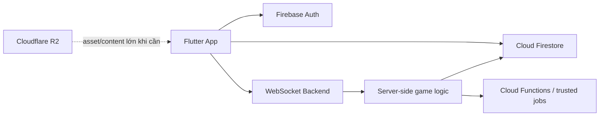
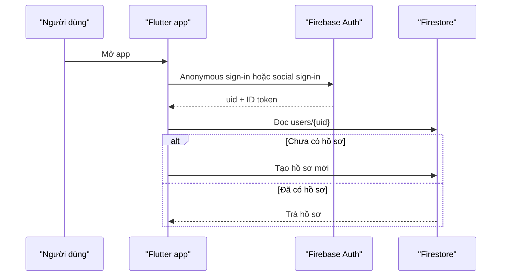
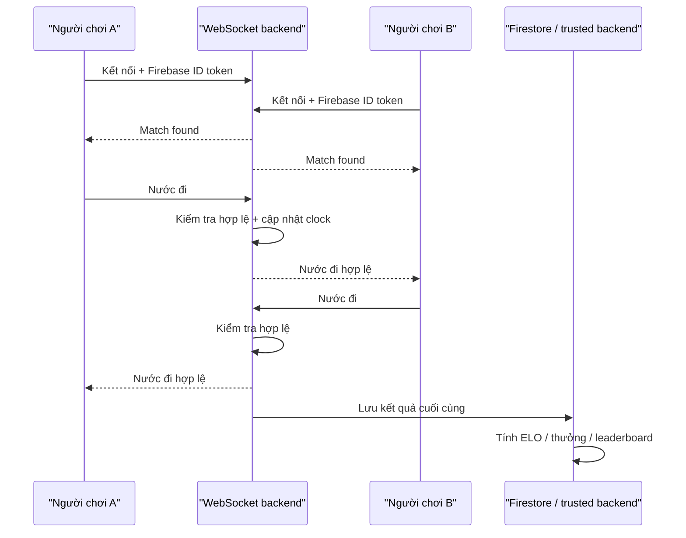

# Kiến trúc backend thực dụng cho CChess

## 1. Mục tiêu của tài liệu

Tài liệu này chốt một phương án backend **đủ đơn giản để triển khai**, nhưng vẫn đủ đúng để CChess có thể mở rộng từ bản local hiện tại sang:

- Đăng nhập thật
- Đồng bộ hồ sơ
- Lưu kỳ phổ trên cloud
- Ghép trận online
- Chơi realtime
- Bảng xếp hạng và thành tích có chống gian lận

Tài liệu này không cố gắng tối ưu cho một sản phẩm đã có hàng triệu người dùng. Mục tiêu là tránh hai sai lầm phổ biến:

1. Dùng quá nhiều hệ thống ngay từ đầu rồi tăng độ phức tạp vận hành
2. Dùng một hệ thống cho mọi việc, kể cả những việc nó không phù hợp

## 2. Kết luận ngắn gọn

Phương án thực dụng nhất cho dự án hiện tại:

```text
Flutter app
  -> Firebase Auth
  -> Cloud Firestore
  -> Backend WebSocket cho trận online
  -> Cloud Functions hoặc backend server-side cho ELO / thưởng / leaderboard
  -> Cloudflare R2 chỉ thêm vào khi có asset hoặc content lớn
```

### Phân vai ngắn gọn

| Thành phần | Vai trò chính |
|---|---|
| Firebase Auth | Danh tính người dùng, đăng nhập, liên kết tài khoản |
| Cloud Firestore | Dữ liệu bền vững của người dùng và nghiệp vụ |
| Backend WebSocket | Trạng thái trận đang diễn ra theo thời gian thực |
| Cloud Functions / server-side logic | ELO, thưởng, leaderboard, xác thực kết quả |
| Cloudflare R2 | File lớn, asset, video, pack nội dung |
| Cloudflare KV | Cache/read-heavy public data nếu sau này thật sự cần |
| Cloudflare Durable Objects | Một lựa chọn cho backend realtime nếu muốn đi theo Cloudflare |

## 3. Vì sao không nên chỉ dùng một hệ thống

### 3.1. Firebase rất hợp cho dữ liệu bền vững

Firebase phù hợp với:

- Auth
- Hồ sơ người dùng
- Đồng bộ đa thiết bị
- Dữ liệu app dạng document
- Rule bảo vệ theo user
- Phát triển mobile nhanh

Trong CChess, các dữ liệu này rất phù hợp với Firestore:

- `users`
- `game_records`
- `daily_quests`
- `achievements`
- `leaderboards`
- `openings`
- `puzzles`

### 3.2. WebSocket rất hợp cho trạng thái đang sống

Một ván online có những dữ liệu thay đổi liên tục:

- Ai đang đi
- Nước vừa đi
- Đồng hồ còn bao nhiêu
- Người chơi nào mất kết nối
- Có yêu cầu hòa hay đầu hàng không
- Người xem đang nhận trạng thái nào

Đây là loại dữ liệu cần:

- Độ trễ thấp
- Server chủ động đẩy sự kiện về client
- Một nguồn sự thật chung cho cả hai người chơi
- Xử lý kết nối lại

Đó là vai trò tự nhiên của backend WebSocket.

### 3.3. Cloudflare có ích, nhưng không phải mặc định cho mọi dữ liệu

Cloudflare nên được dùng đúng sản phẩm:

- `R2`: file lớn, object storage, asset, video, pack JSON
- `KV`: dữ liệu public đọc nhiều, chấp nhận trễ đồng bộ ngắn
- `D1`: SQL serverless nếu về sau cần truy vấn quan hệ rõ ràng
- `Durable Objects`: coordination realtime, ví dụ phòng game

Không nên chuyển toàn bộ user data sang Cloudflare chỉ vì “rẻ hơn”, vì:

- Một số loại dữ liệu cần consistency cao
- Dữ liệu người dùng hiện tại của CChess còn rất nhỏ
- Tách nhiều hệ thống sớm làm tăng độ khó vận hành, backup, migration và debug

## 4. Sơ đồ kiến trúc khuyến nghị



## 5. Dữ liệu nào nên đặt ở đâu

| Loại dữ liệu | Nơi lưu khuyến nghị | Lý do |
|---|---|---|
| Tài khoản, UID, provider đăng nhập | Firebase Auth | Tích hợp tốt với Flutter, an toàn, ít phải tự vận hành |
| Hồ sơ người dùng | Firestore | Cần đồng bộ đa thiết bị, document nhỏ |
| ELO, coins, gems, VIP | Firestore, chỉ server được ghi field nhạy cảm | Dữ liệu tài sản và xếp hạng cần tin cậy |
| Tiến độ quest / achievement | Firestore | Cần đồng bộ, dễ truy vấn theo user |
| Kỳ phổ đã kết thúc | Firestore | Bản ghi bền vững, đọc lại sau |
| Trạng thái ván đang chạy | WebSocket backend | Realtime, nhiều sự kiện, cần trọng tài server |
| Matchmaking queue | WebSocket backend hoặc datastore hỗ trợ realtime | Không nên coi Firestore là hàng đợi game chính |
| Presence online/offline | Realtime Database hoặc WebSocket backend | Dữ liệu tạm thời, thay đổi liên tục |
| Puzzle pack, opening pack, media khóa học | R2 khi khối lượng lớn | File lớn, phát nhiều, chi phí phân phối tốt |
| Public config/cache đọc nhiều | KV nếu sau này cần | Read-heavy, không phù hợp cho dữ liệu tài sản |

## 6. Phân ranh trách nhiệm theo Sprint 8

### 6.1. Sprint 8a - Firebase foundation

Mục tiêu:

- Tạo Firebase project
- Cấu hình app Flutter
- Bật Authentication
- Bật Cloud Firestore
- Có project `dev` và `prod`

Kết quả mong đợi:

- App khởi tạo được Firebase
- Người dùng anonymous đăng nhập được
- Có `uid` ổn định

### 6.2. Sprint 8b - Data contract và cloud sync

Mục tiêu:

- Thiết kế schema Firestore
- Viết rule bảo vệ dữ liệu
- Đồng bộ `UserProfile` local hiện tại lên cloud
- Chốt field nào client được sửa, field nào chỉ server được sửa

Kết quả mong đợi:

- User đổi tên / khu vực được
- User không thể tự sửa `eloChess`, `coins`, `gems`, `creditScore`
- Kỳ phổ đã kết thúc sync được lên cloud

### 6.3. Sprint 8c - Realtime backend

Mục tiêu:

- Có backend nhận kết nối realtime
- Có phòng đấu
- Có xác thực người chơi bằng Firebase ID token
- Có luồng từ `matchmaking -> vào phòng -> gửi nước -> nhận nước -> kết thúc`

Kết quả mong đợi:

- Hai thiết bị có thể chơi một ván online tối thiểu
- Server là nguồn sự thật của trận
- Kết quả cuối cùng được ghi về cloud bởi phía đáng tin cậy

## 7. Luồng nghiệp vụ quan trọng

### 7.1. Luồng đăng nhập



### 7.2. Luồng ván online



## 8. Lưu ý rất quan trọng cho game online

### 8.1. Không tin client

Client chỉ nên gửi:

- Ý định đi nước nào
- Yêu cầu hòa
- Yêu cầu đầu hàng
- Ping / reconnect

Server mới quyết định:

- Nước đó có hợp lệ không
- Ai đến lượt
- Đồng hồ còn bao nhiêu
- Ván đã kết thúc chưa
- ELO thay đổi thế nào

### 8.2. Không ghi từng nước live vào Firestore

Ghi từng nước realtime vào Firestore sẽ:

- Tăng số write rất nhanh
- Làm khó kiểm soát chi phí
- Không phù hợp bằng WebSocket cho luồng đang sống

Khuyến nghị:

- Trong trận: WebSocket backend giữ state
- Sau trận: lưu một `game_record` hoàn chỉnh
- Nếu cần audit, có thể lưu move log theo batch hoặc cuối trận

### 8.3. Field nhạy cảm chỉ server ghi

Các field như:

- `eloChess`
- `eloCup`
- `coins`
- `gems`
- `creditScore`
- `isVip`

không nên để client tự ghi trực tiếp.

## 9. Phương án Cloudflare hợp lý cho CChess

### 9.1. Khi nào nên dùng R2

Dùng R2 khi bạn bắt đầu có:

- Ảnh thumbnail lớn
- Video bài học
- Avatar upload
- Pack puzzle JSON lớn
- Pack khai cuộc
- Tài nguyên tải về nhiều lần

### 9.2. Khi nào cân nhắc KV

Dùng KV cho:

- Public config
- Catalog public ít thay đổi
- Nội dung cache toàn cầu

Không dùng KV cho:

- Số dư tiền
- ELO
- Quest progress
- Trạng thái trận

### 9.3. Khi nào cân nhắc Durable Objects

Nếu bạn muốn backend realtime nằm trên Cloudflare thay vì tự host Node.js:

- Mỗi phòng game có thể map vào một Durable Object
- Durable Object nhận WebSocket của hai người chơi
- Object giữ state chung và điều phối nước đi

Đây là lựa chọn đáng cân nhắc cho multiplayer game, nhưng nó là **một hướng triển khai backend riêng**, không phải điều kiện bắt buộc của Sprint 8.

## 10. Ước lượng dữ liệu và chi phí ở mức quyết định kiến trúc

### 10.1. Dung lượng user data hiện tại

Từ model hiện có của dự án:

- Hồ sơ người dùng: khoảng vài trăm byte
- Trạng thái quest ngày: khoảng hơn một trăm byte
- Một achievement progress: dưới một trăm byte
- Một game record 80 nửa nước: xấp xỉ 1 KB payload

Do đó:

- User mới: khoảng `1-3 KB`
- User chơi 100 ván: khoảng `100 KB` raw payload
- User chơi 1.000 ván: cỡ `1 MB` raw payload

### 10.2. Chỗ tốn tiền trước thường không phải storage

Với app này, nguy cơ vượt free tier thường đến từ:

- Đọc quá nhiều
- Ghi quá nhiều
- Ghi trạng thái realtime vào sai chỗ

Không phải từ hồ sơ người dùng nhỏ.

### 10.3. Nguyên tắc tiết kiệm chi phí

- Chỉ sync field thay đổi
- Không poll liên tục nếu có listener hợp lý
- Không ghi từng tick đồng hồ vào Firestore
- Không ghi từng nước đi live vào Firestore
- Gộp batch khi phù hợp
- Tách file lớn khỏi Firestore

## 11. Các quyết định nên chốt ngay

1. Chốt package ID / bundle ID thật
2. Tạo `dev` và `prod` riêng
3. Chọn Firestore regional gần người dùng chính
4. Quy định field server-only
5. Chốt WebSocket backend là:
   - Node.js riêng
   - hay Cloudflare Durable Objects
6. Chỉ thêm Cloudflare R2 khi có asset/content lớn thật sự

## 12. Phương án mặc định tôi đề xuất cho dự án này

### Giai đoạn gần

- Firebase Auth
- Firestore
- Cloud Functions
- WebSocket backend riêng
- Không thêm Cloudflare data layer ngoài R2

### Giai đoạn sau khi có người dùng thật

- R2 cho media và content pack
- Cache / KV cho public content nếu số liệu chứng minh cần
- Cân nhắc Durable Objects nếu muốn chuyển phòng game sang edge realtime

## 12.1. Trạng thái triển khai (cập nhật 2026-05-21)

Sau 3 session implement, lát kiến trúc thực tế:

| Lớp | Trạng thái | Nơi |
|---|---|---|
| Firebase Auth (Anonymous + Google) | ✅ Bật cho `cchess-dev` + `cchess-prod` | Console |
| Firestore + rules + indexes | ✅ Deployed `cchess-dev` | [cchess/firestore.rules](cchess/firestore.rules), [firestore.indexes.json](cchess/firestore.indexes.json) |
| Cloud Functions: `createFirestoreUser`, `recordRankedGame` | ✅ Deployed `cchess-dev` (Blaze) | [cchess/functions/src/index.ts](cchess/functions/src/index.ts) |
| Flutter cloud sync layer | ✅ Splash auto + ProfileController push | [cchess/lib/data/services/cloud_sync_service.dart](cchess/lib/data/services/cloud_sync_service.dart) |
| WebSocket backend (Node.js + `ws`) | 🟡 Step 1+2 test xanh, Step 3 chưa test E2E | [cchess-backend/src/](cchess-backend/src/) |
| WS server hosting (Render/Railway/Fly.io) | ⬜ Vẫn localhost | — |
| R2 / Cloudflare media | ⬜ Chưa cần | — |

Kiến trúc đang đi đúng phương án đề xuất: Firebase + WS Node.js riêng + Cloud Functions cho ELO. Chưa có Cloudflare gì cả vì media + content pack chưa cần.

## 13. Tài liệu liên quan trong repo

- `01_FEATURE_SPECIFICATION.md`
- `03_PROMPT_FEATURES_ROADMAP.md`
- `04_TOM_TAT_LOGIC_NGHIEP_VU.md`
- `05_KE_HOACH_DU_AN.md`
- `07_HUONG_DAN_THIET_LAP_FIREBASE.md`
- `08_HUONG_DAN_BACKEND_WEBSOCKET.md`
