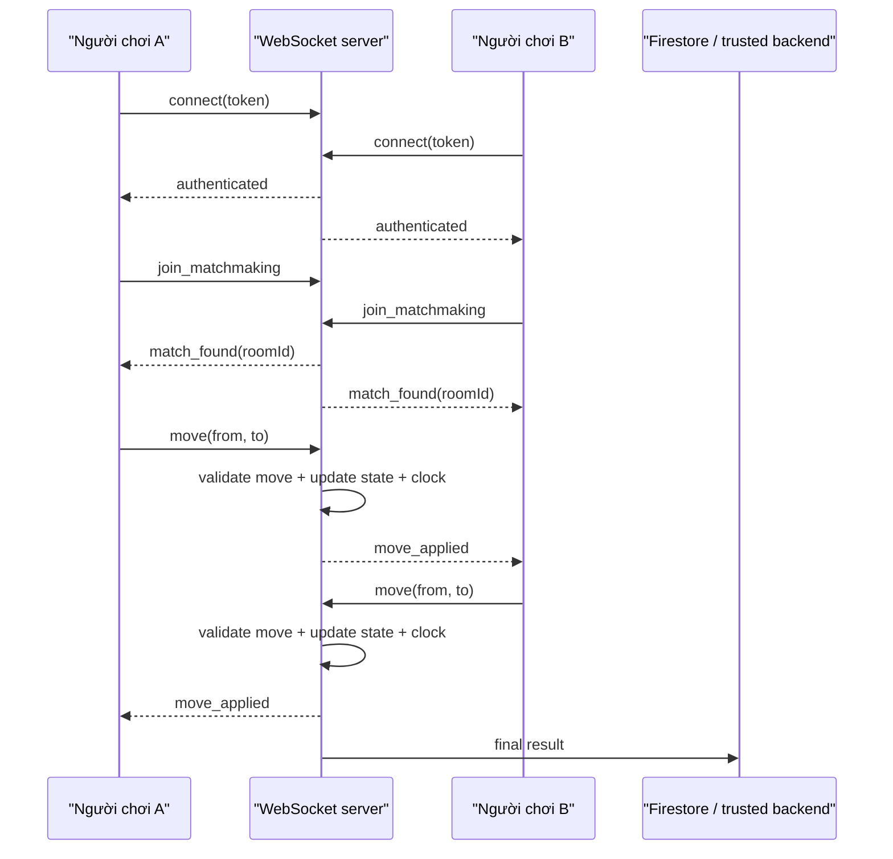

# Hướng dẫn backend WebSocket cho CChess

## 1. Mục tiêu

Tài liệu này hướng dẫn phần `8c` của Sprint 8:

- Hiểu WebSocket là gì
- Biết nó phục vụ chức năng nào trong CChess
- Biết backend tối thiểu cần có những thành phần nào
- Có lộ trình từ prototype đến production

## 2. WebSocket là gì

WebSocket là một kết nối hai chiều, duy trì lâu dài giữa client và server.

Khác với HTTP thông thường:

- HTTP: client hỏi, server trả lời, rồi kết thúc request
- WebSocket: client và server giữ kết nối mở, cả hai bên đều có thể gửi sự kiện bất cứ lúc nào

Đây là cơ chế phù hợp cho:

- Chat
- Multiplayer game
- Presence online/offline
- Spectate
- Notification realtime

## 3. Vì sao CChess cần WebSocket

Một ván cờ online cần:

- Hai người chơi thấy nước đi gần như ngay lập tức
- Đồng hồ được giữ thống nhất
- Server biết ai đang đến lượt
- Hai bên nhận được sự kiện xin hòa / đầu hàng / mất kết nối
- Người xem nhận được trạng thái trận đang diễn ra

Firestore không phải lựa chọn tốt để làm đường truyền chính cho các sự kiện này, vì đây là luồng realtime nhiều cập nhật và cần một trọng tài trung tâm.

## 4. Backend WebSocket sẽ phục vụ chức năng gì

### 4.1. Ngay trong Sprint 8c

- Xác thực client bằng Firebase ID token
- Kết nối người chơi vào server
- Tạo phòng game tối thiểu
- Ghép hai người chơi
- Nhận và phát nước đi
- Giữ state trận hiện tại
- Ghi kết quả cuối trận về backend tin cậy

### 4.2. Ở các sprint sau

- Matchmaking theo ELO
- Chat nhanh
- Emoji
- Spectate
- Reconnect
- Timeout
- Draw offer
- Resign
- Tournament match
- Anti-cheat / audit

## 5. Vai trò của từng bên

| Bên | Được làm gì |
|---|---|
| Client Flutter | Gửi intent: đi nước, xin hòa, đầu hàng, reconnect |
| WebSocket backend | Kiểm tra, quyết định, phát sự kiện chính thức |
| Firestore / server-side jobs | Lưu kết quả bền vững, tính ELO, update leaderboard |

Nguyên tắc:

- Client không tự quyết định thắng thua xếp hạng
- Client không tự cộng ELO
- Client không tự cập nhật tài sản người dùng

## 6. Sơ đồ luồng một ván online



## 7. Kiến trúc backend tối thiểu

### 7.1. Thành phần chính

1. **Connection gateway**
   - Nhận kết nối WebSocket
   - Xác thực token
   - Gắn socket với `uid`

2. **Matchmaking service**
   - Hàng đợi người chờ trận
   - Ghép 2 người chơi theo luật ban đầu

3. **Room manager**
   - Tạo room
   - Gắn player đỏ / đen
   - Giữ state room

4. **Game engine validator**
   - Kiểm tra nước đi hợp lệ
   - Kiểm tra kết thúc ván

5. **Persistence adapter**
   - Ghi `game_record`
   - Gửi job tính ELO

6. **Observability**
   - Log
   - Metrics
   - Tracing sự cố

### 7.2. State tối thiểu của một room

```json
{
  "roomId": "room_123",
  "redUid": "uid_a",
  "blackUid": "uid_b",
  "fen": "initial or current position",
  "moves": [],
  "turn": "red",
  "status": "playing",
  "redTimeMs": 900000,
  "blackTimeMs": 900000,
  "lastMoveAt": "server timestamp"
}
```

## 8. Bộ event khuyến nghị

### 8.1. Client -> server

| Event | Ý nghĩa |
|---|---|
| `auth` | Gửi Firebase ID token |
| `join_matchmaking` | Vào hàng chờ |
| `cancel_matchmaking` | Hủy chờ |
| `make_move` | Gửi nước đi |
| `offer_draw` | Xin hòa |
| `accept_draw` | Đồng ý hòa |
| `resign` | Xin thua |
| `reconnect_room` | Xin nối lại room cũ |
| `ping` | Giữ kết nối / đo latency |

### 8.2. Server -> client

| Event | Ý nghĩa |
|---|---|
| `auth_ok` | Xác thực thành công |
| `auth_failed` | Token lỗi |
| `match_found` | Đã có đối thủ |
| `room_state` | Snapshot room |
| `move_applied` | Nước đi đã được server chấp nhận |
| `move_rejected` | Nước đi bị từ chối |
| `draw_offered` | Đối thủ xin hòa |
| `game_ended` | Ván kết thúc |
| `opponent_disconnected` | Đối thủ mất kết nối |
| `reconnect_ok` | Nối lại thành công |

## 9. Vòng đời của một room

```text
waiting
  -> matched
  -> playing
  -> finished
  -> archived
```

### 9.1. `waiting`

- Có 1 player đang chờ hoặc room chưa đủ người

### 9.2. `matched`

- Đã có 2 player
- Sắp gửi trạng thái bắt đầu

### 9.3. `playing`

- Server nhận move
- Server giữ clock
- Server phát update

### 9.4. `finished`

- Có kết quả chính thức
- Không nhận thêm move

### 9.5. `archived`

- Kết quả đã được lưu bền vững
- Room có thể dọn khỏi memory

## 10. Xác thực với Firebase Auth

### 10.1. Vì sao vẫn dùng Firebase Auth

Bạn không cần tự xây hệ đăng nhập riêng cho backend WebSocket.

Luồng đúng:

1. App đăng nhập bằng Firebase Auth
2. App lấy Firebase ID token
3. App gửi token khi mở kết nối backend
4. Backend xác minh token
5. Backend lấy `uid`

### 10.2. Lợi ích

- Một nguồn danh tính duy nhất
- Không tạo thêm hệ auth song song
- Có thể dùng anonymous account rồi link social login về sau

## 11. Hai lựa chọn triển khai backend

### 11.1. Lựa chọn A - Node.js server riêng

#### Ưu điểm

- Dễ học
- Nhiều ví dụ
- Debug quen thuộc
- Dễ dùng với `socket.io`

#### Nhược điểm

- Bạn phải tự deploy
- Tự lo scale
- Tự lo session affinity / state coordination khi nhiều instance

#### Phù hợp khi

- Bạn muốn học backend truyền thống
- Số người dùng giai đoạn đầu còn ít
- Muốn chủ động cấu trúc code

### 11.2. Lựa chọn B - Cloudflare Durable Objects + WebSockets

#### Ưu điểm

- Rất hợp cho room realtime
- Mỗi room có thể map thành một object riêng
- Có coordination state tốt
- Không phải tự vận hành server truyền thống

#### Nhược điểm

- Cách lập trình khác server Node.js thông thường
- Cần học thêm Workers / Durable Objects
- Một số logic phải thiết kế theo đặc tính edge runtime

#### Phù hợp khi

- Bạn muốn backend realtime theo hướng serverless/edge
- Bạn thích mô hình một room = một coordinator

## 12. Khuyến nghị chọn công nghệ cho bạn

Nếu mục tiêu trước mắt là:

- Học dễ
- Có prototype online nhanh
- Hiểu rõ backend game hoạt động thế nào

thì nên bắt đầu với:

- Node.js
- WebSocket hoặc `socket.io`
- Firebase Admin SDK để verify token

Nếu sau này bạn muốn:

- Giảm gánh vận hành
- Tận dụng Cloudflare edge
- Room game độc lập rõ ràng

thì hãy đánh giá lại Durable Objects.

## 13. Lộ trình triển khai theo bước

> Trạng thái 2026-05-21: Step 1, 2, 3 đã verified E2E trong [`cchess-backend/`](cchess-backend/) (Node 20 + TypeScript + `ws` + `firebase-admin`). Step 4-7 chưa bắt đầu.

### ✅ Bước 1 — Echo server
Mục tiêu:
- Client kết nối được
- Gửi một message
- Server echo lại

**Code thực tế**: [cchess-backend/src/server.ts](cchess-backend/src/server.ts). Connection sends `welcome`, mọi message JSON đều được echo lại với timestamp.

### ✅ Bước 2 — Auth handshake
Mục tiêu:
- Client gửi token
- Server verify token
- Gắn socket với `uid`

**Code thực tế**: [cchess-backend/src/auth.ts](cchess-backend/src/auth.ts) wrap `admin.auth().verifyIdToken()`; server.ts giữ `Map<WebSocket, uid>`, 10s auth timeout (close code `4001`), invalid token → `4002`.

**Client Flutter**: [cchess/lib/data/services/game_socket_service.dart](cchess/lib/data/services/game_socket_service.dart) tự lấy idToken từ `FirebaseAuth.currentUser.getIdToken()` và gửi `{type:'auth', token}`.

**Test**: [cchess/lib/presentation/cloud/backend_test_screen.dart](cchess/lib/presentation/cloud/backend_test_screen.dart) — debug screen, gated `kDebugMode`.

### ✅ Bước 3 — Room thủ công
Mục tiêu:
- Tạo room bằng tay
- Cho 2 user join room
- Broadcast sự kiện giữa hai socket

**Code thực tế**: [cchess-backend/src/rooms.ts](cchess-backend/src/rooms.ts) — `Map<roomId, Room>` + `Map<socket, roomId>`, max 2 members, 6-ký-tự alphabet-only ID (loại bỏ 0/O/1/I gây nhầm). Auto-leave + notify peer khi socket disconnect.

Protocol messages:
- `→ create-room` `← room-created {roomId}`
- `→ join-room {roomId}` `← room-joined {roomId, members, status}` + `← peer-joined {uid}` cho peer cũ
- `→ broadcast {payload}` `← peer-message {from, payload, ts}` cho peer khác
- `→ leave-room` `← left-room` + `← peer-left {uid}` cho peer còn lại

Errors: `room-not-found`, `room-full`, `already-in-room`, `not-in-room`, `missing-room-id`.

**Test E2E** ✓ 2026-05-21: Flutter phone + Chrome console (cùng PC). Verified create-room, join-room, peer-joined, broadcast cả 2 hướng, peer-left khi đóng tab (close code 1005 từ Chrome auto-cleanup OK).

### Bước 4 - Move transport

Mục tiêu:

- Client A gửi nước
- Server nhận, kiểm tra format
- Server phát cho client B

### Bước 5 - Move validation thật

Mục tiêu:

- Server có engine Xiangqi hoặc module kiểm tra luật
- Chỉ move hợp lệ mới được áp dụng

### Bước 6 - Clock server-side

Mục tiêu:

- Server giữ đồng hồ
- Client chỉ hiển thị
- Timeout do server quyết định

### Bước 7 - Persistence

Mục tiêu:

- Khi ván kết thúc, backend ghi game record
- Gửi job tính ELO / leaderboard

### Bước 8 - Reconnect

Mục tiêu:

- Người chơi mất mạng có thể quay lại room trong một khoảng grace period

## 14. Những lỗi thiết kế cần tránh

### 14.1. Client là nguồn sự thật

Sai:

- Client tự đổi turn
- Client tự cộng clock
- Client tự báo thắng

Đúng:

- Client chỉ render từ state server gửi về

### 14.2. Polling thay cho realtime

Nếu cứ vài giây lại hỏi server:

- Tốn tài nguyên
- Trễ
- Khó mượt

### 14.3. Ghi mọi move vào Firestore ngay lập tức

Sai vì:

- Nhiều write
- Tăng chi phí
- Không giải quyết tốt clock / reconnect

### 14.4. Không thiết kế reconnect

Game mobile chắc chắn sẽ:

- Tắt màn hình
- Chuyển mạng
- Mất Wi-Fi

Không có reconnect thì trải nghiệm online sẽ rất tệ.

## 15. Backend nên lưu gì sau trận

Sau khi room kết thúc, ghi tối thiểu:

- `roomId`
- hai người chơi
- màu của mỗi người
- danh sách move
- kết quả
- lý do kết thúc
- duration
- thời điểm bắt đầu / kết thúc
- thay đổi ELO

Nếu cần audit mạnh hơn, có thể lưu thêm:

- event log
- latency sample
- reconnect count

## 16. Tích hợp với phần Flutter hiện tại

Hiện app đã có:

- `GameScreen`
- `GameController`
- `XiangqiGame`
- `GameRecord`

Khi thêm online:

- Giữ UI hiện tại càng nhiều càng tốt
- Tách `local/bot/online` thành các nguồn state khác nhau
- Online mode không tự mutate game state dựa vào client intent
- Chỉ apply khi backend xác nhận `move_applied`

## 17. Checklist hoàn thành Sprint 8c

- [x] Client kết nối backend được — `WebSocketChannel.connect`
- [x] Backend verify Firebase token được — `admin.auth().verifyIdToken`
- [x] Có room state tối thiểu — `rooms.ts`
- [x] Hai client join cùng room được — verified 2026-05-21
- [ ] Gửi / nhận move realtime được (Step 4)
- [ ] Server từ chối move sai (Step 5)
- [ ] Server giữ turn chính xác (Step 5-6)
- [ ] Có clock server-side (Step 6)
- [ ] Có `game_ended`
- [ ] Ghi được kết quả cuối về cloud — `recordRankedGame` callable đã deploy
- [ ] Có reconnect cơ bản (Step 8)

## 18. Sau Sprint 8c mới nên làm gì

Khi backend tối thiểu đã ổn, hãy triển khai tiếp:

1. Matchmaking theo ELO
2. Ranked game
3. Spectate
4. Chat nhanh
5. Leaderboard
6. Tournament

## 19. Tài liệu liên quan trong repo

- `05_KE_HOACH_DU_AN.md`
- `06_KIEN_TRUC_BACKEND_THUC_DUNG.md`
- `07_HUONG_DAN_THIET_LAP_FIREBASE.md`

## 20. Tài liệu chính thức nên đọc thêm

- Verify ID Tokens - Firebase Authentication
- Use WebSockets - Cloudflare Durable Objects
- Cloudflare Durable Objects overview
